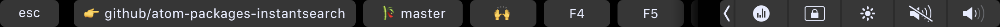

# zsh iTerm Touchbar

> Display feedback of terminal in the 🍏 Touchbar




Currently it shows:

  * Current directory (F1) 👉
  * Current git branch (F2) 🎋
  * Current git repo status (F3) 🔥 / 🙌
    * `+` — uncommitted changes in the index;
    * `!` — unstaged changes;
    * `?` — untracked changes;
    * `$` — stashed changes;
    * `⇣` — unpulled commits;
    * `⇡` — unpushed commits.


### Requirements

* iTerm2 3.1.beta.3 (OS 10.10+) - [Download](https://www.iterm2.com/downloads.html)
* [zsh](http://www.zsh.org/) shell
* a zsh-framework like [antigen](http://antigen.sharats.me/) or [zgen](https://github.com/tarjoilija/zgen)

**Into iterm2:** Go into `View -> Customize Tool Bar...` and drag & drop the `Fn` module

### Installing plugin

#### For antigen users

Add the following snippet `~/.zshrc` after the line antigen use oh-my-zsh:

```
antigen theme https://github.com/iam4x/zsh-iterm-touchbar
```

#### For Zgen users

Add the following line to your `~/.zshrc` where you're adding your other zsh plugins:

```
zgen load iam4x/zsh-iterm-touchbar
```

### Read more

https://gitlab.com/gnachman/iterm2/issues/5281
