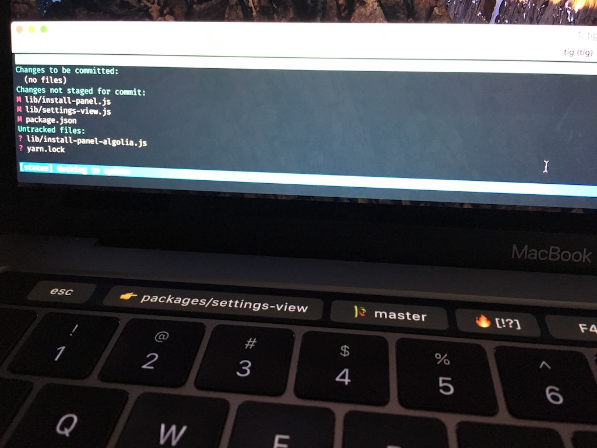

# zsh iTerm Touchbar

> Display feedback of terminal in the 🍏 Touchbar




Currently it shows:

  * F1 - Current directory 👉
  * F2 - Current git branch, press to display all branches and switch between them 🎋
  * F3 - Current git repo status 🔥 / 🙌
    * `+` — uncommitted changes in the index;
    * `!` — unstaged changes;
    * `?` — untracked changes;
    * `$` — stashed changes;
    * `⇣` — unpulled commits;
    * `⇡` — unpushed commits.
  * F4 - Push to origin branch (git push origin [branch]) ✉️
  * F5 - Display `npm-run` or `yarn-run` scripts from `package.json` ⚡️ /🐱

### Requirements

* iTerm2 3.1.beta.3 (OS 10.10+) - [Download](https://www.iterm2.com/downloads.html)
* [zsh](http://www.zsh.org/) shell
* a zsh-framework like [antigen](http://antigen.sharats.me/) or [zgen](https://github.com/tarjoilija/zgen)

**Into iterm2:** Go into `View -> Customize Tool Bar...` and drag & drop the `Fn` module

### Installing plugin

#### For oh-my-zsh users

Clone the repo in your plugins directory:

* `$ cd ${ZSH_CUSTOM1:-$ZSH/custom}/plugins`
* `$ git clone https://github.com/iam4x/zsh-iterm-touchbar.git`

Then add the plugin into your `~/.zshrc`:

```
plugins=(... zsh-iterm-touchbar)
```

#### For antigen users

Add the following snippet `~/.zshrc` after the line antigen use oh-my-zsh:

```
antigen theme https://github.com/iam4x/zsh-iterm-touchbar
```

#### For Zgen users

Add the following line to your `~/.zshrc` where you're adding your other zsh plugins:

```
zgen load iam4x/zsh-iterm-touchbar
```

### Customize

ENV variables for git icons:

```shell
GIT_UNCOMMITTED="+"
GIT_UNSTAGED="!"
GIT_UNTRACKED="?"
GIT_STASHED="$"
GIT_UNPULLED="⇣"
GIT_UNPUSHED="⇡"
```

ENV variables to enable or disable yarn:

```shell
YARN_ENABLED=true
```

### Read more / Credits

* [Original iTerm2 issue for TouchBar support](https://gitlab.com/gnachman/iterm2/issues/5281)
* [Thank's to spaceship-zsh-theme for git functions](https://github.com/denysdovhan/spaceship-zsh-theme/blob/9dbaee2cc6cfe0ac407cf901ebb97894ed279660/spaceship.zsh#L143-L173)
